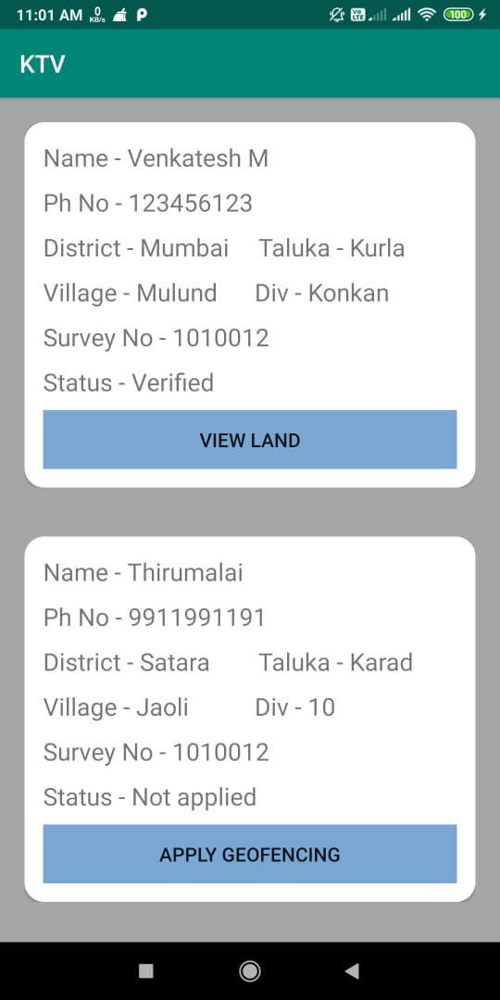

# DigiSaatBara : Geo-fencing and Efficient Crop Prediction for farmers using land Documents


The Goverment Documents like Saat Bara Documenents and Soil Health Card contain large amount of Unstructured Data. These data can be made to put to use for the Usage of Farmers


<br><br>


The SaatBaara Documents contain detailed reports of the following factors in land usage

- Total Area of Land
- Land Under Cultivation (Per Crop Season)
  - Crop Season
  - Crop Cultivated
  - Area Cultivated (In Hectares)
  - Irrigation Water Source
  - Irrigated Area (In Hectares)
  - Mixed Crop / Single Crop
- Land Not Available For Cultivation 
  - Area not cultivated (In Hectares) 
  - Usage 
  - Irrigation Equipment
- Land Landmarks for Demarcation
<br>
<br>


The Soil  Health Card Provides complete information about the Soil Contents 
<br>


The project focuses on creation of the entire system for data collection and generating detailed reports after data analysis from the collected and predicted data. <p>
The approach consists of a mobile app and a website which has two users the government admin and landholders. The main focus of the application is extracting information from 7 / 12 for geofencing of land and crop prediction for farmers and generating a final report for landholders which contains</p>

 - Information about the land 
 - Soil health card of the land 
 - History of the crops grown on the land 
 - Prediction of crops that can be grown 
 - Analysis of the costs incurred for each predictions 
 - Area circumscribed by the geo-fence coordinates on the map
  

## Android App
 Our Android uses Google SDKs for Marking the Geo Coordinates of the Land from the Users 
<p align="left">
  
 
 
 </p>

 To Reduce False Inputs the Area Marked in the Polygon should be within  ~2% of the Area mentioned in the Land Documents

## Web App

The Crop Prediction helps the Farmers to get an Idea of the Resources requirements of the Farmers

>To install the requirements of Environment 
```bash
pip install -r requirements.txt
```

To Run the Flask Environment 
```bash
python3 main.py
```
The Server starts and go to localhost:5000
```bash
* Serving Flask app "main" (lazy loading)
* Environment: production
WARNING: This is a development server. Do not use it in a production deployment.
   Use a production WSGI server instead.
* Debug mode: on
* Restarting with stat
* Debugger is active!
* Debugger PIN: 822-438-218
* Running on http://127.0.0.1:5000/ (Press CTRL+C to quit)
 ```

The Predictions will be shown in the website which will be easily interpreted by the farmer
<br>


